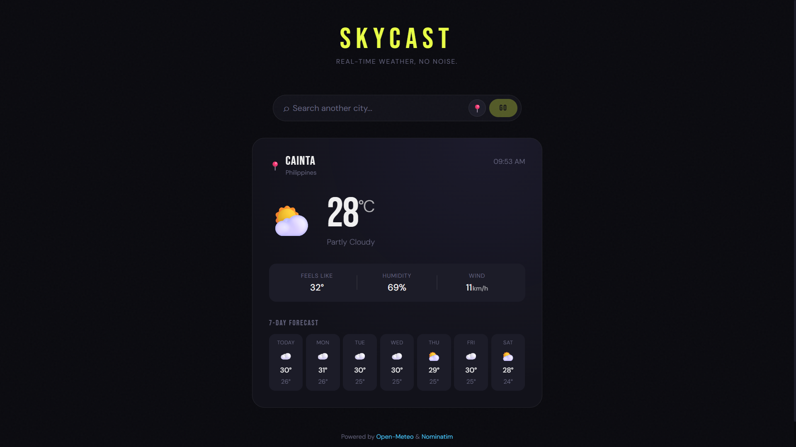

# Skycast


A real-time weather app built with Vue 3 and Vite, featuring automatic location detection, city search, and a 7-day forecast — powered entirely by free, no-key APIs.



## About

Skycast is a weather application that shows you current conditions and a 7-day forecast for any city in the world. It automatically detects your location on load, so you get your local weather instantly without typing anything.

This is my **first Vue.js project**. I chose a weather app because it pushed me to learn the things that matter most in real-world development — API calls, reactive state, component design, and handling async flows — all in a single project.

## Features

- **Auto Location Detection**: Detects your city on load using the browser Geolocation API
- **City Search**: Search any city worldwide with instant results
- **Current Conditions**: Temperature, feels like, humidity, and wind speed
- **7-Day Forecast**: Daily highs, lows, and weather icons for the week ahead
- **Dynamic UI**: Background glow adapts to the current weather condition
- **Live Clock**: Real-time clock that updates every second
- **Responsive Design**: Fully mobile-friendly, works on any screen size
- **No API Key Required**: Built entirely on free, open APIs

## What I Learned

Building Skycast was my introduction to Vue and the Composition API. Here's what I picked up:

**Vue 3 Composition API**
- Using `ref()` and `computed()` for reactive state
- Lifecycle hooks like `onMounted()` and `onUnmounted()`
- How Vue's template system re-renders automatically when state changes
- Scoped `<style>` blocks to keep component styles isolated

**Composables**
- Extracting reusable logic into composable functions (`useWeather.js`)
- Separating data-fetching concerns from the UI layer
- Sharing reactive state across components without a state management library

**API Integration**
- Chaining multiple `fetch()` calls with `async/await`
- Geocoding (city name → coordinates) and reverse geocoding (coordinates → city name)
- Handling loading, error, and empty states cleanly in the UI

**Browser APIs**
- Geolocation API and permission handling
- Gracefully degrading when users deny location access

**Responsive Design**
- Using CSS `clamp()` for fluid typography and spacing without breakpoints
- `100dvh` for correct full-screen layout on mobile browsers
- Safe area insets for notched devices (iPhone X+)

## Tech Stack

- **Framework**: Vue 3 (Composition API)
- **Build Tool**: Vite 5
- **Styling**: Scoped CSS with CSS custom properties
- **Weather Data**: [Open-Meteo API](https://open-meteo.com/)
- **Geocoding**: [Open-Meteo Geocoding API](https://open-meteo.com/en/docs/geocoding-api)
- **Reverse Geocoding**: [Nominatim / OpenStreetMap](https://nominatim.org/)
- **Package Manager**: NPM

## Installation

### Prerequisites

- Node.js >= 18
- NPM

### Setup

1. Clone the repository
```bash
git clone https://github.com/yourusername/skycast.git
cd skycast
```

2. Install dependencies
```bash
npm install
```

3. Start the development server
```bash
npm run dev
```

Visit `http://localhost:5173` to see the app. Allow location access when prompted to get your local weather automatically.

### Build for Production

```bash
npm run build
npm run preview
```

## Project Structure

```
skycast/
├── public/
│   └── favicon.svg                  # Custom SVG weather icon
├── src/
│   ├── main.js                      # App entry point
│   ├── style.css                    # Global styles and CSS variables
│   ├── App.vue                      # Root component — layout and state handling
│   ├── components/
│   │   ├── SearchBar.vue            # City search input with locate button
│   │   └── WeatherCard.vue          # Weather display and 7-day forecast
│   └── composables/
│       └── useWeather.js            # All API logic — fetch, geocode, reverse geocode
├── index.html
├── vite.config.js
└── package.json
```

## API Reference

Skycast uses three free APIs — no authentication required.

**City Search (Geocoding)**
```
GET https://geocoding-api.open-meteo.com/v1/search?name={city}&count=1
```

**Weather Forecast**
```
GET https://api.open-meteo.com/v1/forecast
    ?latitude={lat}&longitude={lon}
    &current=temperature_2m,apparent_temperature,relative_humidity_2m,wind_speed_10m,weathercode
    &daily=weathercode,temperature_2m_max,temperature_2m_min
    &timezone=auto&forecast_days=7
```

**Reverse Geocoding**
```
GET https://nominatim.openstreetmap.org/reverse?lat={lat}&lon={lon}&format=json
```

## Roadmap

- [ ] Hourly forecast view
- [ ] Toggle between °C and °F
- [ ] Save recently searched cities
- [ ] Animated weather backgrounds
- [ ] PWA support for installable app experience

## Contributing

Feel free to fork this project and submit pull requests. For major changes, please open an issue first to discuss what you'd like to change.

## License

This project is open-sourced software licensed under the [MIT license](https://opensource.org/licenses/MIT).

## Author

- GitHub: [@paulaxisabel](https://github.com/paulaxisabel)

## Acknowledgements

- [Open-Meteo](https://open-meteo.com/) for the completely free weather and geocoding API
- [Nominatim](https://nominatim.org/) and the OpenStreetMap contributors for reverse geocoding
- The Vue.js documentation — one of the best-written docs I've come across

---

Built with ☀️ using Vue 3